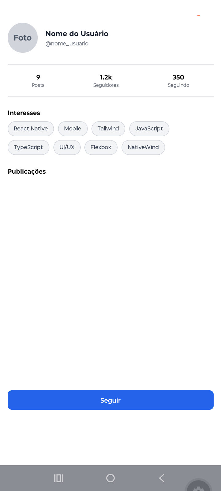

```markdown
# Atividade - Estilização e Flexbox

Projeto desenvolvido para a disciplina de Programação para Dispositivos Móveis (Campus Surubim - UPE)[cite: 1].

## 🚀 Como executar o projeto

### Pré-requisitos
* **Node.js** instalado na sua máquina
* Aplicativo **Expo Go** instalado no seu celular (Android ou iOS)

### Passo a passo

1. **Clone o repositório:**
   ```bash
   git clone [https://github.com/SEU-USUARIO/SEU-REPOSITORIO.git](https://github.com/SEU-USUARIO/SEU-REPOSITORIO.git)

```

2. **Acesse a pasta do projeto:**
```bash
cd meu-projeto

```


3. **Instale as dependências:**
```bash
npm install

```


4. **Inicie o servidor do Expo:**
```bash
npx expo start

```


5. **Execute no dispositivo:**
* Abra o aplicativo **Expo Go** no seu celular.
* Escaneie o **QR Code** exibido no terminal.


```

```


